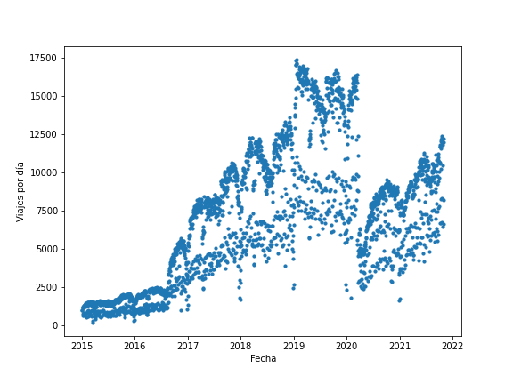
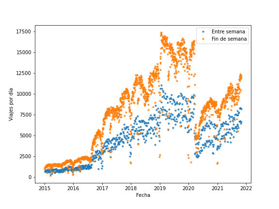
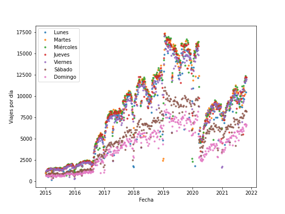
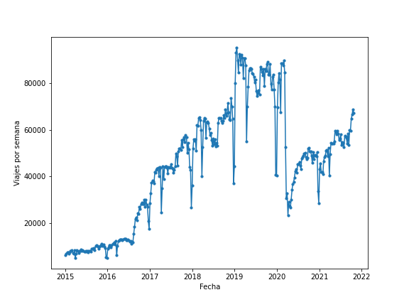
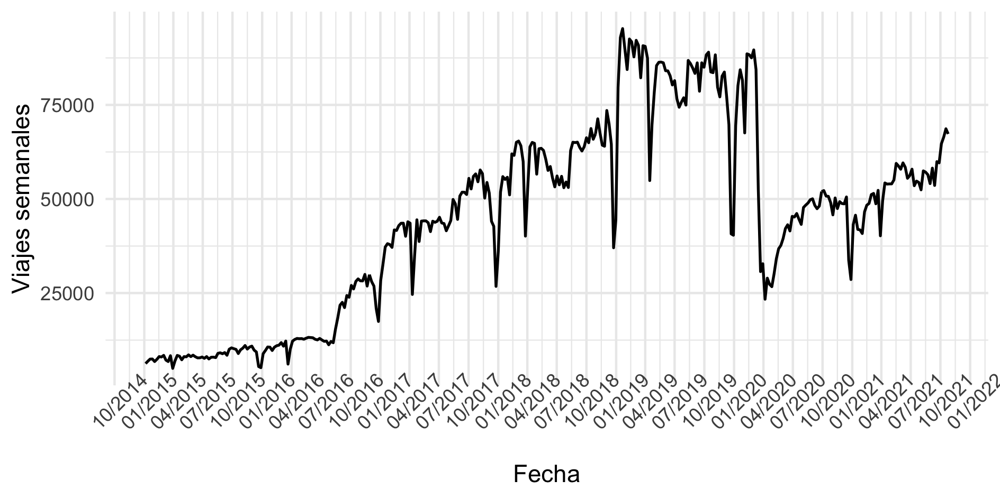
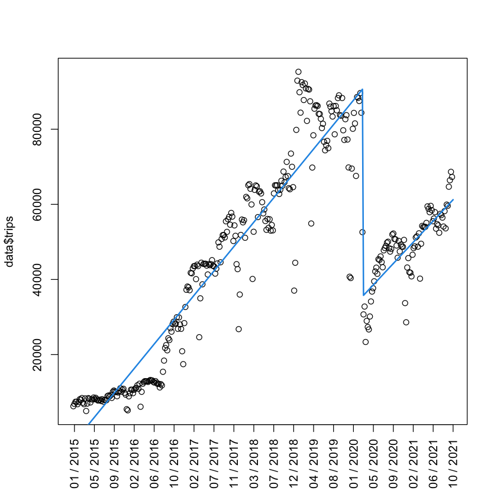
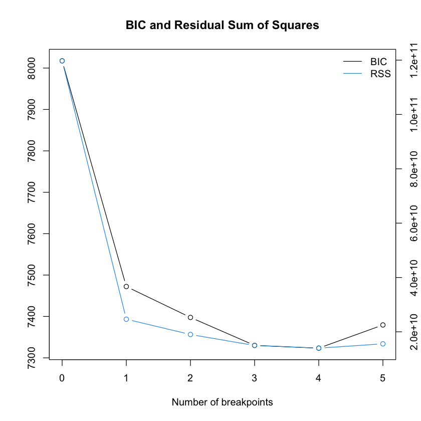
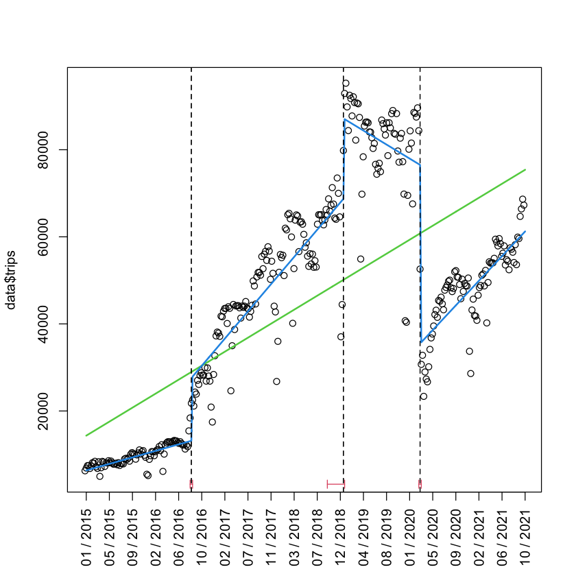
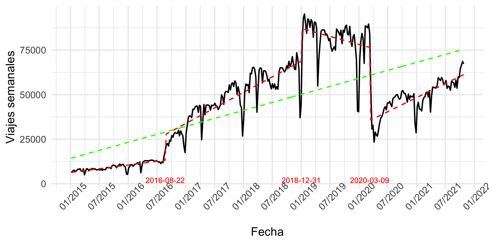
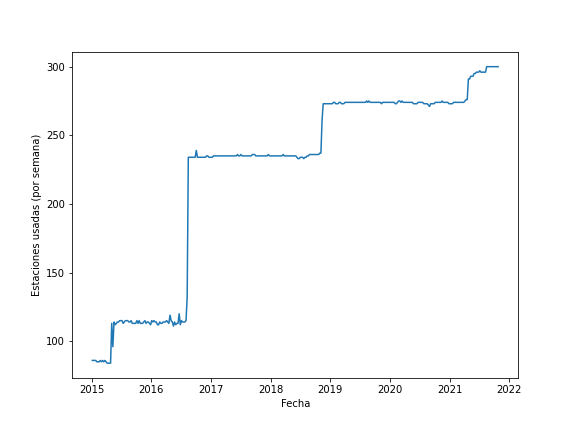

# Proyecto de Análisis de Datos

En este trabajo analizamos los datos abiertos del programa de renta de bicicletas "Mi Bici" de la zona metropolitana de Guadalajara. En particular nos interesa conocer el impacto que han tenido políticas públicas en la evolución del programa y poder brindar información que permita evaluar el programa. 

Para hacer este análisis, el presente reporte se divide de la siguiente forma:

- En la sección [Análisis Exploratorio de Datos](#análisis-exploratorio-de-datos) describimos brevemente la información que incluye los datos y algunos descubrimientos que hicimos explorando y graficando algunas variables
- En la sección [Cambios de Estructura](# Cambios-de-Estructura) explicamos cómo es posible obtener puntos de quiebre donde la estructura de la serie de tiempo cambia, además interpretamos los resultados obtenidos al usar dichos métodos
- En la sección [Análisis de las estaciones](# análisis-de-las-estaciones) tratamos de proporcionar gráficas informativas sobre el uso de las estaciones en las diferentes etapas del programa
- Finalmente, en [Conclusiones y Comentarios Finales](# Conclusiones-y-Comentarios-Finales) damos algunas conclusiones y trabajo a desarrollar en el futuro

Sin más preámbulo, pasamos a describir la limpieza de los datos y los resultados de su análisis exploratorio.

---

## Análisis Exploratorio de Datos

- Importación de datos
- Variables de interés
- Obtención de las series de tiempo
- ¿Cómo agrupar el número de viajes?
- ¿Cómo obtener los viajes entre estaciones?
- ¿Cómo obtener la fecha de inscripción de nuevos usuarios?


Aquí van gráficas:









entre otras.

---

## Cambios de estructura



Dado un conjunto de datos $\{(Y_i, X_i)\}_{i=1}^n$ con $X_i \in \R$, suponemos que existen $k$ intervalos $[a_i, a_{i+1}]$ para $i \in \{1, \dots, k\}$, de forma tal que es posible dividir las observaciones en estos intervalos, es decir para índices en $I_j$ , $(Y_i, X_i)_{i \in I_j} \in [a_j, a_j+1]$ de forma tal que hay una relación lineal entre estos datos que puede o no estar relacionada con el modelo lineal de los otros intervalos. 

¿Bajo qué condiciones se puede dar este supuesto? Es posible que se tenga un experimento a través del tiempo donde las condiciones las experimento cambian por una cierta temporalidad. En nuestro caso queremos probar la hipótesis de que el comportamiento del número de viajes realizados ha cambiado por la pandemia o no. 

De ser cierta la hipótesis, se dice que los datos presentan un **cambio de estructura** y a los puntos $a_2, \dots, a_{k-1}$ como **punto de quiebre**. El problema cambia dependiendo de la información que poseemos.

Estudiemos primero el caso donde conocemos que existe un solo punto de quiebre y nos interesa evaluar la hipótesis

$H_0: \text{no existe cambio de estructura.}$

La hipótesis puede ser descrita formalmente de la siguiente forma:

$H_0: Y_i = \beta X_i + u_i, \quad \forall i\in\{1, \dots, n\},$

mientras que la hipótesis alternativa sería:

$H_1: \exist \quad i_0 \in \{1, \dots, n\} \text{ tal que } \begin{cases}Y_i = \beta_A X_i + u_i \quad 1 \leq i \leq i_0\\ Y_i = \beta_B X_i + u_i \quad i_0 < i \leq n\end{cases},\beta_A \neq \beta_B.$

[Chow (1960)](https://www.jstor.org/stable/1910133) propuso un estadísitico que puede ser usado para probar esta hipótesis cuando el valor $i_0$ es conocido. Para ello propone ajustar dos modelos de regresión lineal de forma independiente para cada uno de los dos intervalos definidos por $i_0$, y rechazar la hipótesis alternativa si el cociente:
$$
F_{i_0} = \frac{\hat u^\top \hat u - \hat e ^\top \hat e}{\hat e^\top \hat e / (n - 2)}
$$
es mayor que un cierto valor, donde $\hat e = (\hat u_A, \hat u_B)\top$ son los residuales de cada modelo de regresión ajustado de forrma independiente en su intervalo y $\hat u$ son los residuales del modelo lineal ajustado a toda la muestra.

Chow demuestra que bajo $H_0$, el estadísitico se distribuye asintóticamente  una $\chi^2_1$ y, si $u_i \sim \mathcal N$, el estadísitico $F_{i_0}$ sigue una distribución $F$ con $n-2$ grados de libertad.

Sin embargo, dado que desconocemos el valor de $i_0$, [Andrews (1993)](https://www.jstor.org/stable/2951764) propone calcular el estadístico $F$ para todos los posibles puntos de quiebre y rechazar la hipótesis nula si para alguno se llega a un valor alto. Para deterrminar si alguno de los valores llega a ser alto, se puede usar el estadístico:

$\sup F = \sup_{1< i <n} F_i.$

Usando este estadístico de prueba, evaluamos la hipótesis nula para saber si existe evidencia suficiente para suponer que la pandemia ha provocado un cambio en la estructura del número de viajes que se realizan en el sitema MiBici de Guadalajara.


### Experimentos con un solo punto de quiebre

Usando la librería `strucchange` de `R`, calculamos estadístico $F$ para todo punto en nuestros datos. Esto se puede realizar con la función `Fstats`. Observe que para los modelos de regresión usamos como único predictor el tiempo.

```R
res <- Fstats(trips ~ date + 1, data = data) # F statistics

plot(res2, xaxt = "n", xlab = "") # Plot F statistics
axis(1, labels=labels, at = ticks/length(data$X), las=2)
# Print line at i arg sup F
breakpoints(res2)
lines(breakpoints(res2))
```


​    En los resultados observmos un linea punteada el posible punto de quiebre para el cual se obtiene el valor del estadísitico $F$ más alto.

    	 Optimal 2-segment partition: 
    
    Call:
    breakpoints.Fstats(obj = res2)


    

Note que el máximo lo obtenemos en fechas cercanas a febrero de 2020. Además observamos como todos los valores rebasan la linea roja que corresponde al valor máximo de la prueba a nivel $\alpha=0.05$. Quiere decir que con un nivel del 95 %, rechazamos la hipótesis nula para cualquier punto.

El p-valor sorrespondiente a $\sup F$ es menor a $10^{-15}$. Practicamente 0.

```R
sctest(res, type="supF")
```


​    

    	supF test
    
    data:  res2
    sup.F = 1358.7, p-value < 2.2e-16


Podemos graficar los modelos de regresión que resultan para cada intervalo. Estos se ven así:


Se aprecia como ambas rectas aproximan bien los datos. Sin embargo observamos que existe un comportamiento diferente en 2015 y 2016, comparrado con 2017 a 2019. Esto puede ser un indicativo de más cambios de estructura que los que contemplamos originalmente. 

Antes de evaluar esta posibilidad, vamos a ubicar con precisión el punto de quiebre obtenido y evaluar la calidad de los modelos lineales ajustados.


```R
bp <- breakpoints(res)
```


```R
data$date[bp$breakpoint]
```

<time datetime="2020-03-09">2020-03-09</time>

Se observa que el punto de quiebre obtenido corresponde a la semana del 9 de marzo de 2020, que corresponde con la semana de [suspensión de clases presenciales](https://www.animalpolitico.com/2020/03/jalisco-suspende-clases-universidades-eventos-masivos-coronavirus/) es el estado de Jalisco. 

Por otro lado, los modelos de regresión parecen ajustarse bien a los datos:

```R
fm1 <- lm(trips ~ breakfactor(bp)/date - 1, data = data)
```


```R
summary(fm1)
```


​    

    Call:
    lm(formula = trips ~ breakfactor(bp)/date - 1, data = data)
    
    Residuals:
       Min     1Q Median     3Q    Max 
    -46783  -4269    467   5072  25152 
    
    Coefficients:
                                   Estimate Std. Error t value Pr(>|t|)    
    breakfactor(bp)segment1      -8.191e+05  1.614e+04 -50.743  < 2e-16 ***
    breakfactor(bp)segment2      -7.583e+05  9.845e+04  -7.702 1.37e-13 ***
    breakfactor(bp)segment1:date  4.963e+01  9.281e-01  53.478  < 2e-16 ***
    breakfactor(bp)segment2:date  4.330e+01  5.284e+00   8.195 4.70e-15 ***
    ---
    Signif. codes:  0 ‘***’ 0.001 ‘**’ 0.01 ‘*’ 0.05 ‘.’ 0.1 ‘ ’ 1
    
    Residual standard error: 8367 on 352 degrees of freedom
    Multiple R-squared:  0.974,	Adjusted R-squared:  0.9737 
    F-statistic:  3297 on 4 and 352 DF,  p-value: < 2.2e-16

Los p-valores del estadístico $T$ son muy chicos y  $R^2 \approx 0.97$, muy cerca de $1$.


### Experimentos con múltiples puntos de quiebre

Dado que para muchos valores obtenemos un valor alto de $F$ y por la inspección visual de los datos, es razonable pensar en la existencia de más puntos de quiebre en nuestros datos. Para ello podemos usar el mismo razonamiento hecho con anterioridad, pero ahora evaluar el estadísitico para los dos intervalos obtenidos. Esto es, hacer un análisis para el intervalo que va del primero de enero de 2015 al 9 de marzo de 2020, y otro para el intervalo del 9 de marzo de 2020 a la fecha. 

Sin embargo este enfoque solo nos va a permitir determinar un punto de quiebre a la vez. Los autores de la librería `strucchange` ponen a nuestra disposición algunos métodos más elaborados para la detección de multiples puntos de quiebre. Dentro de sus propuestas se considera un proceso de fluctuación basado en estimar de forma recursiva modelos de regresión lineal para diferentes ventanas de tiempo. Dado que el estudio de estos procesos de fluctuación están fuera del alcance del curso, nos limitamos a utilizar dicha función y discutir los modelos de regresión que se ajustan con los nuevos puntos de quiebre.

==To do:==

- Discutir la suma de residuos cuando se agregan uno, dos y tres puntos de quiebre, así como discutir la desición de tomar solo 3 puntos.
- Discutir los estadísticos $T$ para los modelos usando los tres puntos de quiebre.
- Discutir la posible causa de los puntos de quiebre (ampliación del número de estaciones vs modelos de regresión ==pendiente==).


```R
re.bikes <- efp(trips ~ date + 1, data = data, type = "ME")
plot(re.bikes)

## dating
bp.bikes <- breakpoints(trips ~ date + 1, data = data)
summary(bp.bikes)
lines(bp.bikes)

## minimum BIC partition
plot(bp.bikes)
breakpoints(bp.bikes)

bp.bikes2 <- breakpoints(serie ~ data$date + 1, breaks = 3)
fm0 <- lm(trips ~ date + 1, data = data)
fm1 <- lm(trips ~ breakfactor(bp.bikes2)/ date - 1, data = data)

## confidence interval
ci <- confint(bp.bikes2, level = 0.95)

## plot
plot(data$X, data$trips, xaxt = "n", xlab = "")
axis(1, labels=labels, at = ticks, las=2)

lines(fitted(fm0), col = 3, lwd = 2)
lines(fitted(fm1), col = 4, lwd = 2)
lines(bp.bikes2)
lines(ci)
```


​    

    	 Optimal (m+1)-segment partition: 
    
    Call:
    breakpoints.formula(formula = trips ~ date + 1, data = data)
    
    Breakpoints at observation number:
                              
    m = 1                  271
    m = 2              209 271
    m = 3      86      209 271
    m = 4      85  150 209 271
    m = 5   53 106 159 212 271
    
    Corresponding to breakdates:
                                                                                   
    m = 1                                                                          
    m = 2                                                         0.587078651685393
    m = 3                     0.241573033707865                   0.587078651685393
    m = 4                     0.23876404494382  0.421348314606742 0.587078651685393
    m = 5   0.148876404494382 0.297752808988764 0.446629213483146 0.595505617977528
                            
    m = 1   0.76123595505618
    m = 2   0.76123595505618
    m = 3   0.76123595505618
    m = 4   0.76123595505618
    m = 5   0.76123595505618
    
    Fit:
                                                                   
    m   0         1         2         3         4         5        
    RSS 1.198e+11 2.464e+10 1.901e+10 1.497e+10 1.398e+10 1.557e+10
    BIC 8.018e+03 7.472e+03 7.398e+03 7.330e+03 7.323e+03 7.379e+03


    


    	 Optimal 5-segment partition: 
    
    Call:
    breakpoints.breakpointsfull(obj = bp.bikes)
    
    Breakpoints at observation number:
    85 150 209 271 
    
    Corresponding to breakdates:
    0.238764 0.4213483 0.5870787 0.761236 



    



    


```R
summary(fm1)
```


​    

    Call:
    lm(formula = trips ~ breakfactor(bp.bikes2)/date - 1, data = data)
    
    Residuals:
       Min     1Q Median     3Q    Max 
    -37872  -1903    492   3757  16818 
    
    Coefficients:
                                          Estimate Std. Error t value Pr(>|t|)    
    breakfactor(bp.bikes2)segment1      -1.816e+05  6.812e+04  -2.666 0.008041 ** 
    breakfactor(bp.bikes2)segment2      -7.867e+05  4.157e+04 -18.925  < 2e-16 ***
    breakfactor(bp.bikes2)segment3       5.271e+05  1.205e+05   4.375  1.6e-05 ***
    breakfactor(bp.bikes2)segment4      -7.583e+05  7.717e+04  -9.826  < 2e-16 ***
    breakfactor(bp.bikes2)segment1:date  1.143e+01  4.070e+00   2.809 0.005249 ** 
    breakfactor(bp.bikes2)segment2:date  4.780e+01  2.379e+00  20.089  < 2e-16 ***
    breakfactor(bp.bikes2)segment3:date -2.458e+01  6.649e+00  -3.697 0.000254 ***
    breakfactor(bp.bikes2)segment4:date  4.330e+01  4.142e+00  10.455  < 2e-16 ***
    ---
    Signif. codes:  0 ‘***’ 0.001 ‘**’ 0.01 ‘*’ 0.05 ‘.’ 0.1 ‘ ’ 1
    
    Residual standard error: 6558 on 348 degrees of freedom
    Multiple R-squared:  0.9842,	Adjusted R-squared:  0.9838 
    F-statistic:  2711 on 8 and 348 DF,  p-value: < 2.2e-16




---

## Análisis de las estaciones



- ¿La apertura de nuevas estaciones justifica el aumento de viajes? <- ==Aquí debe ir el estudio de viajes entre estaciones==
- ¿El aumento de viajes se da gracias a nuevos usuarios o a los usuarios ya inscritos en el programa? <- ==Posible nuevo aspecto a explorar==

---

## Conclusiones y Comentarios Finales

.


Trino.
